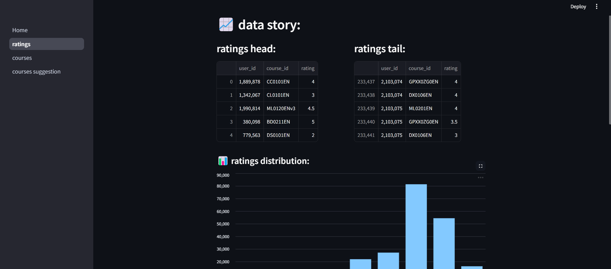
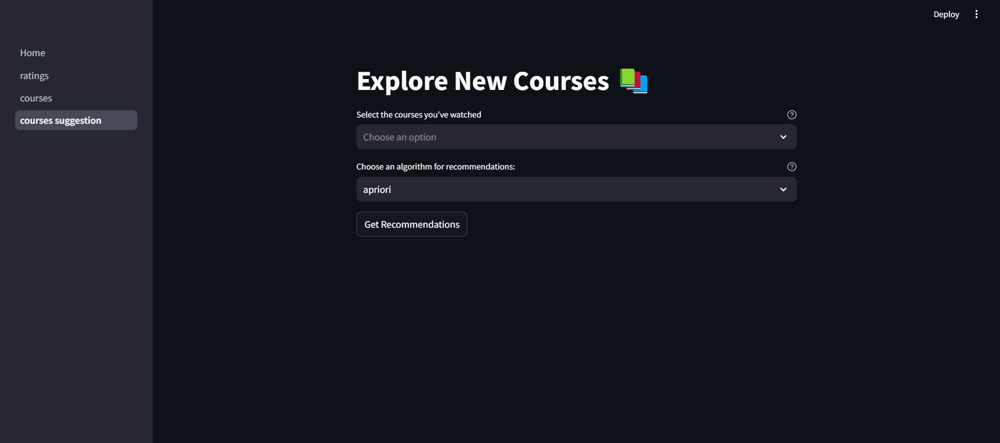

**📚 Courses Recommender**  
A course recommendation system using Streamlit and machine learning algorithms (Apriori, FP-Growth, Eclat) to suggest personalized courses based on user preferences.

**📌 Features**  
✅ Recommend courses based on user preferences
✅ Supports Apriori, FP-Growth, and Eclat algorithms
✅ Interactive Streamlit interface
✅ User-friendly and easy to use

**🚀 Installation & Setup**  

1️⃣ Clone the Repository =>  

git clone https://github.com/DadouneIkram/courses-recommender.git
cd courses-recommender-main

2️⃣ Install Dependencies =>  

Make sure you have Python installed, then run:
pip install -r requirements.txt

3️⃣ Run the Application =>

streamlit run ui/Home.py

**🛠 Technologies Used**  
- Python   
- Streamlit (for the web interface)  
- Pandas (for data processing)  
- mlxtend (for machine learning algorithms)  